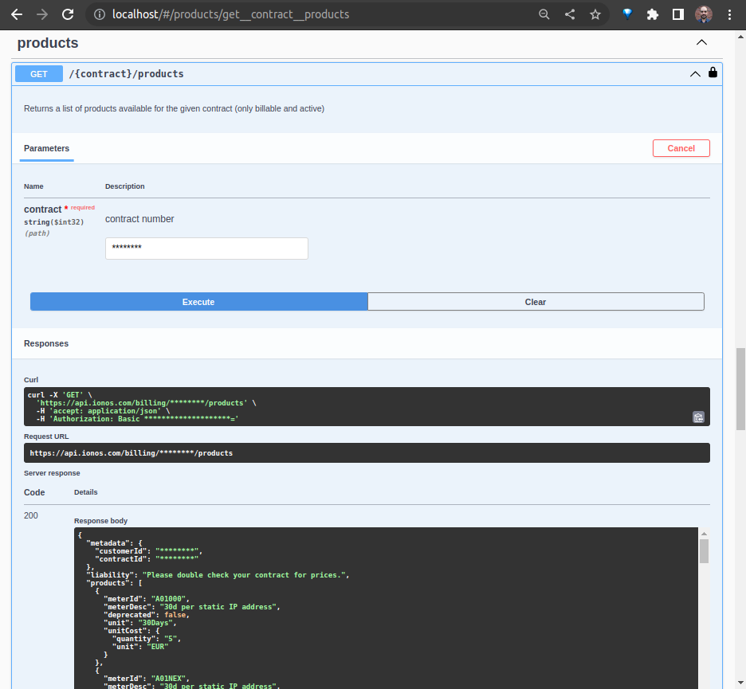

# Getting Started with the IONOS Cloud APIs

> **Warning**
>
> The utilities, notes and code-snippets included in this repository are provided _without warranty_, to help diagnose potential issues more quickly and/or to provide examples of how to perform certain maintenance tasks or operations.
>
> While every effort has been made to ensure that the information and/or code contained herein is current and works as intended, it has not been through any formal or rigorous testing process, and therefore should be used at your own discretion.
>
> For _definitive_ information and documentation, please refer to [docs.ionos.com/cloud](https://docs.ionos.com/cloud/)

Here you will find some simple examples of how you can use some of the APIs listed under [docs.ionos.com/reference](https://docs.ionos.com/reference) — for more information, just click on the `.md` files shown above.


## Making your first API Call
Before getting your feet wet with the other examples in this subdirectory, we should probably make the following _trivial_ API call to confirm that you can successfully authenticate yourself and retrieve your contract information via the [Cloud API](https://api.ionos.com/docs/cloud/v6/).

(The following snippets assume that you've already set the `IONOS_USERNAME` and `IONOS_PASSWORD` or, preferably, the `IONOS_TOKEN` environment variables, but these are also required by most other SDKs and Configuration Management Tools, so now is as good a time as any to add them to your `.bashrc` (or similar) file. For information on how to generate a token, see, e.g., [ionosctl / Authentication / Login](https://docs.ionos.com/cli-ionosctl/subcommands/authentication/login) and [TokenGenerate](https://docs.ionos.com/cli-ionosctl/subcommands/authentication/token-generate).)


### From the Shell

```bash
# This will prompt you for your password
curl --silent --user ${IONOS_USERNAME} "https://api.ionos.com/cloudapi/v6/contracts"
# Assuming IONOS_PASSWORD is set (and valid), this will return your contract information directly
curl --silent --user "${IONOS_USERNAME}:${IONOS_PASSWORD}" "https://api.ionos.com/cloudapi/v6/contracts"
# And for those not wanting to save your password in clear-text, you can use your IONOS_TOKEN instead
curl --silent --header "Authorization: Bearer ${IONOS_TOKEN}" "https://api.ionos.com/cloudapi/v6/contracts"
```


### Using Python 3

```python
import os
import getpass
import requests
import json

IONOS_USERNAME = os.environ.get('IONOS_USERNAME', "")
IONOS_PASSWORD = os.environ.get('IONOS_PASSWORD', "")

if IONOS_PASSWORD == "":
  IONOS_PASSWORD = getpass.getpass(prompt="Please enter your password: ")

# Setup our session
session = requests.Session()
session.auth = (IONOS_USERNAME, IONOS_PASSWORD)

# Authenticate against the Cloud API to retrieve our Contract Number
auth = session.post('https://api.ionos.com/cloudapi/v6')
res = session.get('https://api.ionos.com/cloudapi/v6/contracts').json()
print(json.dumps(res, indent=2))
```

While not really any more secure, if you'd rather use the Base-64 encoded version of your `USERNAME:PASSWORD` (e.g. that could be generated in bash by running the command `read -p "Enter credentials in 'USERNAME:PASSWORD' format: " INPUT; echo -n $INPUT | base64`), then you could retrieve that string from its corresponding environment variable, and replace the line `session.auth = (IONOS_USERNAME, IONOS_PASSWORD)` with `session.headers = { 'Authorization': "Basic %s" % IONOS_BASE64_AUTH }`.


The following snippet allows you to retrieve the same information using the preferred token / 'bearer' authentication scheme (it also shows how one can use the square bracket operator to retrieve specific information from a parsed JSON object):


```python
import os
import requests
import json

IONOS_TOKEN = os.environ.get('IONOS_TOKEN', "")

# Setup our session
session = requests.Session()
session.headers = { 'Authorization': "Bearer %s" % IONOS_TOKEN }

# Authenticate against the Cloud API to retrieve our Contract Number
auth = session.post('https://api.ionos.com/cloudapi/v6')
res = session.get('https://api.ionos.com/cloudapi/v6/contracts').json()
print(json.dumps(res, indent=2))
# And retrieve the contents of the JSON path 'items[0].properties.contractNumber'
print(f"Contract Number = {str(res['items'][0]['properties']['contractNumber'])}")
```


## Exploring the APIs more Interactively
In addition to the human-readable documentation over at, e.g., [api.ionos.com/docs/cloud](https://api.ionos.com/docs/cloud/), you can use the corresponding [OpenAPI specification](https://api.ionos.com/docs/public-cloud-v6.ga.json) and a tool like [Swagger UI](https://swagger.io/tools/swagger-ui) or [Postman](https://postman.com) to try out API calls interactively, and to see Curl command line examples.


### Using Swagger UI


If you're on a computer with a working installation of [Docker Engine](https://docs.docker.com/engine/) or [Docker Desktop](https://docs.docker.com/desktop/) that's capable of running amd64-based Linux images, you could run the following command to start a local instance of the Swagger UI, and then point your web browser to http://localhost

```
docker run --rm -p 80:8080 -e SWAGGER_JSON_URL=${OPENAPI_SPEC_URL} swaggerapi/swagger-ui
```

The OpenAPI Specification is always linked-to via the 'Download' button at the top of each APIs 'home page' at [api.ionos.com/docs](https://api.ionos.com/docs) however, for the Cloud API, `OPENAPI_SPEC_URL` would be https://api.ionos.com/docs/public-cloud-v6.ga.json, and for the Billing API, you would use https://api.ionos.com/docs/public-billing-v3.ga.json — just remember to authenticate yourself by clicking on the 'Authorize' button shown towards the top of the Swagger UI page first.


### Using Postman
An arguably much more powerful and flexible tool is [Postman](https://postman.com).

To add an API, perform the following steps (though the exact details can vary depending on whether or not you are logged in, etc.):

- Select File --> Import, enter the URL corresponding to the OpenAPI specification of your choice (e.g., https://api.ionos.com/docs/public-cloud-v6.ga.json), and click on the 'Import' button;
- Under 'Collections', select the _top-level_ entry for the API you just imported'
- On the 'Auth' tab, choose a Type of either `Bearer Token` or `Basic Auth` (noting that the Billing API only supports `Basic Auth`), enter the appropriate data, _and select 'Save'_;
- ... (need to figure out bug with the OpenAPI spec file)


### Using `ionosctl` in Trace Mode
Another way to 'generate' more complex examples that might not be immediately obvious from the API specifications is via the [ionosctl](https://docs.ionos.com/cli-ionosctl) command-line tool. By invoking this command with the `IONOS_LOG_LEVEL` environment variable set to `trace`, you can see which endpoints are called with which data; these traces can then be combined into one or more API calls.

By way of a somewhat verbose example, given the following (truncated) output:

```
$ export IONOS_LOG_LEVEL=trace
$ ionosctl server create --datacenter-id ${DATACENTER_UUID} --cores 1 --cpu-family INTEL_SKYLAKE --ram 1024 --name "Example server"
Authorization: Bearer .....
Content-Type: application/json
IONOSLOG DumpRequestOut : POST /cloudapi/v6/datacenters/7b5a9a9e-.../servers HTTP/1.1
Accept-Encoding: gzip
{"properties":{"availabilityZone":"AUTO","cores":1,"cpuFamily":"INTEL_SKYLAKE","name":"Unnamed Server","ram":1024,"type":"ENTERPRISE"}}
...
{
  "id" : "557c9886-3c50-4607-8067-e90f917dba6a",
  "type" : "server",
  "href" : "https://api.ionos.com/cloudapi/v6/datacenters/7b5a9a9e-.../servers/557c9886-3c50-4607-8067-e90f917dba6a",
   ...
}
...
$ export SERVER_UUID="557c9886-3c50-4607-8067-e90f917dba6a"
$ ionosctl volume create --datacenter-id ${DATACENTER_UUID} --name "Boot volume" --size 10GB --type HDD --image-alias debian:11 --password dentivermall32 --licence-type LINUX
IONOSLOG DumpRequestOut : POST /cloudapi/v6/datacenters/7b5a9a9e-.../volumes HTTP/1.1
{"properties":{"availabilityZone":"AUTO","bus":"VIRTIO","imageAlias":"debian:11","imagePassword":"dentivermall32","licenceType":"LINUX","name":"Boot volume","size":10,"type":"HDD"}}
$ ionosctl volume create --datacenter-id ${DATACENTER_UUID} --name "Data volume" --size 10GB --type HDD --licence-type OTHER
IONOSLOG 2023/03/21 18:51:43  DumpRequestOut : POST /cloudapi/v6/datacenters/7b5a9a9e-.../volumes HTTP/1.1
{"properties":{"availabilityZone":"AUTO","bus":"VIRTIO","licenceType":"OTHER","name":"Data volume","size":10,"type":"HDD"}}
...
$ ionosctl nic create --datacenter-id ${DATACENTER_UUID} --server-id ${SERVER_UUID} --lan-id 1 --name eth0 --dhcp=true
IONOSLOG DumpRequestOut : POST /cloudapi/v6/datacenters/7b5a9a9e-.../servers/557c9886-3c50-4607-8067-e90f917dba6a/nics HTTP/1.1
{"properties":{"dhcp":true,"firewallActive":false,"firewallType":"INGRESS","ips":[],"lan":1,"name":"eth0"}}
...
$ ionosctl nic create --datacenter-id ${DATACENTER_UUID} --server-id ${SERVER_UUID} --lan-id 2 --name eth1 --dhcp=false
IONOSLOG DumpRequestOut : POST /cloudapi/v6/datacenters/7b5a9a9e-.../servers/557c9886-3c50-4607-8067-e90f917dba6a/nics HTTP/1.1
{"properties":{"dhcp":false,"firewallActive":false,"firewallType":"INGRESS","ips":[],"lan":2,"name":"eth1"}}

```

one could create the following composite API call:

```
DATACENTER_UUID=""
API_ENDPOINT="https://api.ionos.com/cloudapi/v6/datacenters/${DATACENTER_UUID}/servers"
DATA=$(cat << EOF
{
	"properties": {
		"availabilityZone": "AUTO",
		"cores": 1,
		"cpuFamily": "INTEL_SKYLAKE",
		"name": "Example server",
		"ram": 1024,
		"type": "ENTERPRISE"
	},
	"entities": {
		"volumes": {
			"items": [
				{
					"properties": {
						"availabilityZone": "AUTO",
						"bus": "VIRTIO",
						"bootOrder": "PRIMARY",
						"cpuHotPlug": true,
						"imageAlias": "debian:11",
						"imagePassword": "dentivermall32",
						"name": "Boot volume",
						"nicHotPlug": true,
						"nicHotUnplug": true,
						"ramHotPlug": true,
						"size": 10,
						"type": "HDD"
					}
				},
				{
					"properties": {
						"availabilityZone": "AUTO",
						"bus": "VIRTIO",
						"bootOrder": "NONE",
						"licenceType": "OTHER",
						"name": "Data volume",
						"size": 10,
						"type": "HDD"
					}
				}
			]
		},
		"nics": {
			"items": [
				{
					"properties": {
						"dhcp": false,
						"firewallActive": false,
						"firewallType": "INGRESS",
						"ips": [],
						"lan": 1,
						"name": "eth0"
					}
				},
				{
					"properties": {
						"dhcp": true,
						"firewallActive": false,
						"firewallType": "INGRESS",
						"ips": [],
						"lan": 2,
						"name": "eth1"
					}
				}
			]
		}
	}
}
EOF
)


curl -X POST "${API_ENDPOINT}?pretty=true&depth=0" \
  -H "accept: application/json" \
  -H "Authorization: Bearer ${IONOS_TOKEN}" \
  -H "Content-Type: application/json" \
  -d "${DATA}"

```